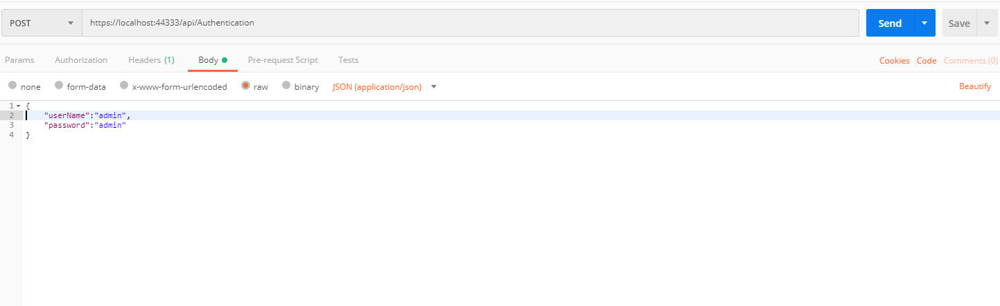

# Run The Project 

# Local

## Login The Application : 
After the project solution is successfully generated as per the mentioned project structure. After the project is successfully build, let's access the authentication api.

1) Open postman >  new request >  select request type as post > pass the url having route `api/Authentication`

For Eg : https://localhost:**Your_generated_port_number**/api/Authentication 

2) In body pass data in the form of `raw` of type JSON(application/json) > pass UserName and Password as json object as shown below: 

> These are the login credentails of the default user inserted in the `Users` table while creation of the database.

3) Click on Send Button

This will hit the `PostLogin` method of Authentication controller which will generate a `JWT web token` which will be further used to make requests to the APIs which are created with HTTPStatus Code 200.  

For creating API and accessing it, <a class="redirect-link" href="/rx-web-core/developing-the-api/basic-controller">Accessing The Api</a>.  
# Docker

Coming Soon

